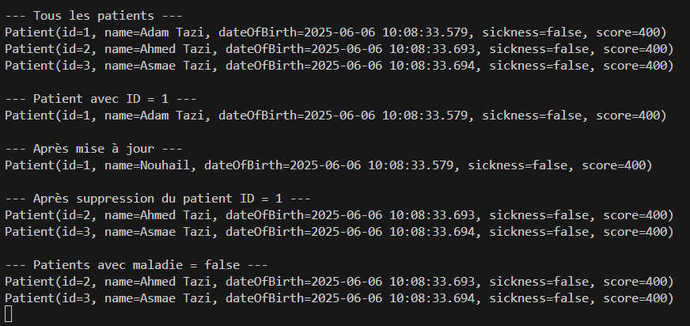
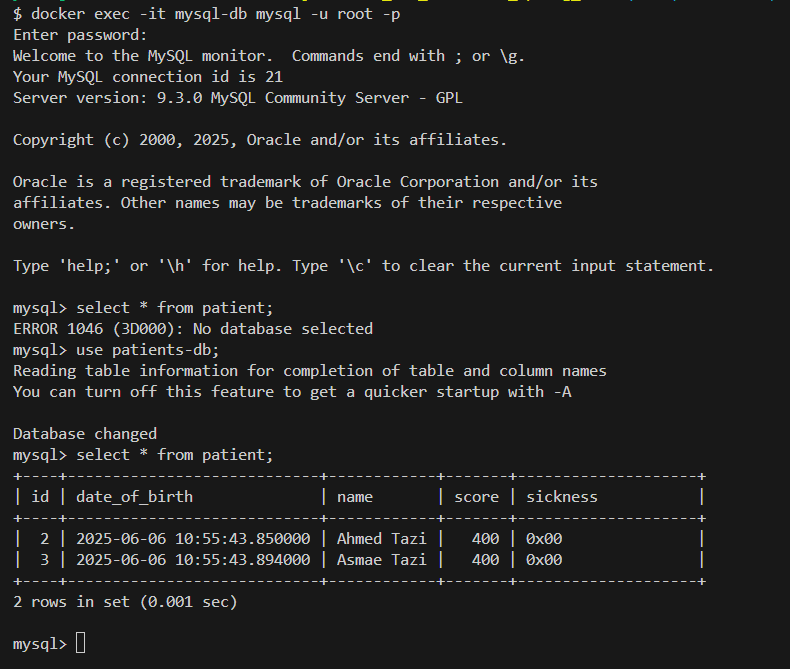

# Gestion Patients - Spring Boot & JPA

## Présentation
Ce projet est une application web développée avec Spring Boot permettant de gérer des patients, des médecins, des rendez-vous et des consultations. Il illustre l'utilisation de l'injection de dépendances, de JPA/Hibernate, et de la persistance relationnelle avec H2/MySQL.

## Fonctionnalités principales
- Ajout, consultation, modification et suppression de patients
- Gestion des médecins, rendez-vous et consultations
- Recherche de patients par nom ou état de santé
- Migration possible de la base H2 vers MySQL

## Technologies utilisées
- Java 17
- Spring Boot 3
- Spring Data JPA
- Lombok
- H2 Database (par défaut) / MySQL (optionnel)
- Maven Wrapper

## Structure du projet
```
Dependency_Injection_Framework/
├── src/
│   ├── main/
│   │   ├── java/
│   │   │   └── com/example/patientapp/
│   │   │       ├── entities/
│   │   │       ├── repositories/
│   │   │       └── PatientappApplication.java
│   │   └── resources/
│   │       └── application.properties
│   └── test/
├── captures/
│   ├── img.png
│   └── img_2.png
├── pom.xml
├── mvnw / mvnw.cmd
└── README.md
```

## Démarrage rapide
1. **Cloner le projet**
2. **Lancer la base H2 (par défaut)**
   ```
   ./mvnw spring-boot:run
   ```
3. **Accéder à la console H2** : [http://localhost:8080/h2-console](http://localhost:8080/h2-console)
   - JDBC URL : `jdbc:h2:mem:testdb`

## Configuration MySQL (optionnelle)
Pour utiliser MySQL, modifiez `src/main/resources/application.properties` :
```
spring.datasource.url=jdbc:mysql://localhost:3306/patientdb
spring.datasource.username=root
spring.datasource.password=VOTRE_MDP
spring.jpa.database-platform=org.hibernate.dialect.MySQL8Dialect
```
Créez la base `patientdb` dans MySQL avant de lancer l'application.

## Exemples d'entités gérées
- Patient (id, nom, dateNaissance, malade, score)
- Medecin (id, nom, specialite, email)
- RendezVous (id, date, patient, medecin)
- Consultation (id, date, rendezVous, diagnostic, traitement)
- User & Role (sécurité, optionnel)

## Exemples d'opérations
- Ajouter un patient
- Lister tous les patients
- Chercher par nom ou état
- Modifier ou supprimer un patient

## Captures d'écran

### Exemple d'interface


### Vue base de données



